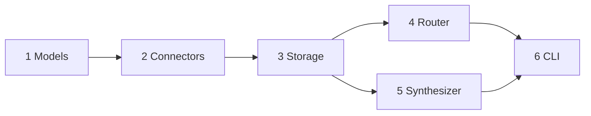

# Implementation Plan: Founder AI Assistant Context Engine

Live build checklist. `ARCHITECTURE.md` is the source of truth. If a milestone needs a contract change, run `/pivot` first (ADR plus architecture rewrite), then update this file.

Each milestone follows the loop in `WORKFLOW.md`: grill the edge cases, write tests and watch them fail, implement until green, run `/code-review`, then commit. Do not start a milestone until the previous milestone's acceptance checks pass.

## Build order

Router and synthesizer both depend only on storage and models, so they can be built in either order. The CLI is the only module that wires everything together.

## Fixed reference values

These literals are used across tests. Do not recompute them inside assertions.

| Name                           | Value                                                             |
| ------------------------------ | ----------------------------------------------------------------- |
| Reference timestamp            | `2026-09-23T09:00:00Z`                                            |
| Day window start               | `2026-09-23T00:00:00Z` = `1790121600`                             |
| Day window end                 | `2026-09-23T23:59:59Z` = `1790207999`                             |
| Week window start              | `2026-09-21T00:00:00Z` = `1789948800`                             |
| Week window end                | `2026-09-27T23:59:59Z` = `1790553599`                             |
| Focus set (evaluation corpus)  | `cal_001`, `cal_002`, `cal_003`, `email_203`, `email_205`         |
| Follow-ups (evaluation corpus) | `email_203`, `email_204`, `email_205` (latest message per thread) |
| Next meeting                   | `cal_001`                                                         |
| Repeated customer issue        | `email_201`, `email_202`, `email_203` (EU checkout retry failure) |

## Settled decisions

Recorded as ADR-0003 through ADR-0007. `ARCHITECTURE.md` is rewritten. Each item is the live contract.

- [x] **Storage returns `list[ContextItem]`** (ADR-0003).
- [x] **Storage adds `title` to Chroma metadata at write time** (ADR-0003).
- [x] **Email metadata gains `thread_id`** (ADR-0004). Approved test change: add `"thread_id": "thr_9"` to expected metadata in `tests/test_connectors.py`.
- [x] **Router returns `list[SearchPlan]`** (ADR-0005).
- [x] **`SearchPlan` gains `order_by`** (ADR-0005).
- [x] **Router resolves five time phrases** (ADR-0005).
- [x] **Follow-ups are per thread** (ADR-0004).
- [x] **Router LLM failures retry once, then raise** (ADR-0005).
- [x] **Reference timestamp** via `FOUNDER_REFERENCE_TIME` (ADR-0005).
- [x] **Embeddings** use Chroma's default local model (ADR-0003).
- [x] **CLI entrypoint** is `python main.py` (ADR-0006).
- [x] **Empty description or body is accepted**; only a missing field raises `NormalizationError`.
- [x] **Router classification is System 1, not a frontier LLM** (ADR-0007). Jev returns typed intent and time-window labels. Python builds every `SearchPlan` and every epoch bound. Ingestion does not call Jev. The frontier LLM is reserved for synthesis. Public `plan_query` and `retrieve` signatures stay as specified below. `SearchPlan` gains no new fields.

---

## Milestone 1: Models and schemas — done

Commit: `1224f40`

**Files**

- `src/models/__init__.py`
- `tests/test_models.py`

**Inputs and outputs**

- In: typed field values.
- Out: frozen `ContextItem`; `SearchPlan` with safe defaults.

**Tasks**

- [x] `ContextItem` is frozen (assigning to a field raises).
- [x] `timestamp` must be timezone-aware.
- [x] `metadata` values are limited to `str`, `int`, `float`, and `bool`.
- [x] `source` is limited to `calendar` and `email`.
- [x] `SearchPlan` defaults: no source filter, no epoch bounds, `requires_action_only` false.

**Acceptance**

- [x] `pytest tests/test_models.py` passes (5 tests).

**Do not break**

- Metadata must stay flat. Chroma rejects nested values, and this validator is the first guard.
- Adding a new `Source` value means a `/pivot`, because the router and synthesizer citation formats depend on it.

---

## Milestone 2: Mock connectors — done

Commit: `1224f40`

**Files**

- `src/connectors/base.py`, `calendar.py`, `gmail.py`, `__init__.py`
- `tests/test_connectors.py`, `tests/fixtures/*.json`
- `data/calendar.json`, `data/emails.json`

**Inputs and outputs**

- In: a JSON file path (defaults are `data/calendar.json` and `data/emails.json`).
- Out: `list[ContextItem]`, or `NormalizationError` if any record is bad.

**Tasks**

- [x] `BaseConnector.fetch_records() -> list[ContextItem]`.
- [x] Calendar mapping follows section 4.1: `cal_` id, attendees joined with `", "`, no `requires_action` key.
- [x] Email mapping follows section 4.1: `email_` id, `sender`, `requires_action`, `category` in metadata.
- [x] Missing fields, naive timestamps, unparseable timestamps, or unreadable files raise `NormalizationError`. No partial output.
- [x] The evaluation corpus covers the day window, older follow-ups, and a repeated customer defect.
- [x] Add `thread_id` to email metadata (approved test change: add `"thread_id": "thr_9"` to the expected metadata in `test_email_record_normalizes_to_context_item`). Watch it fail, then update `gmail.py`.

**Acceptance**

- [x] `pytest tests/test_connectors.py` passes (4 tests).
- [x] Still passes after the `thread_id` change.

**Do not break**

- Unit tests read `tests/fixtures/` only. Editing `data/` must never change a unit test result.
- Calendar metadata must never gain `requires_action` (ADR-0002).

---

## Milestone 3: ChromaDB storage

**Files**

- `src/storage/__init__.py` (a `ContextStore` class)
- `tests/test_storage.py`
- `requirements.txt` (add `chromadb`)
- `.gitignore` (add `chroma_db/`)

**Inputs and outputs**

- `ContextStore(path: Path, embedding_function=None)` opens a `PersistentClient` at `path` (default `./chroma_db`). It uses the collection `founder_context` with cosine distance.
- `upsert(items: list[ContextItem]) -> None`
- `search(query: str, n_results: int = 5, where: dict | None = None) -> list[ContextItem]`: ranked by similarity.
- `fetch(where: dict | None = None, limit: int | None = None) -> list[ContextItem]`: filter only, no vector ranking, earliest first. Used for time-ordered plans and for reading whole threads.
- `count() -> int`

**Tasks**

- [x] `/pivot` is done for the storage decisions (return type, stored `title`).
- [x] Red: write `tests/test_storage.py` against a real Chroma client in `tmp_path`.
- [x] Green: implement `ContextStore`.
- [x] Ingest with `upsert`, not `add`, so running ingestion twice is safe.
- [x] Add `title` to the stored metadata; rebuild `ContextItem` from document, metadata, and `timestamp_epoch`.
- [x] Make the embedding function injectable. Filter tests use a small deterministic embedding, so they never depend on a model download.

**Acceptance (pytest checks)**

- [x] Storage tests build their own `ContextItem` literals (two meetings and two emails, one of each outside the day window). Upserting them gives `count() == 4`. Upserting the same items again still gives 4.
- [x] `where={"source": "email"}` returns only email items.
- [x] `where={"requires_action": True}` returns no calendar items.
- [x] An epoch-range `where` with `$gte` / `$lte` excludes items outside `1790121600`–`1790207999`.
- [x] A search hit round-trips to a `ContextItem` equal to the original item.
- [x] `fetch(where={"source": "calendar"}, limit=1)` returns the earliest meeting, regardless of similarity.
- [x] Data survives closing and reopening the client on the same path.
- [x] `pytest tests/` passes (all earlier tests are still green).

**Edge cases**

- Chroma `$and` needs at least two clauses. A single filter must be passed as a plain dict.
- An empty filter must be passed as `None`, not `{}`.
- When the filter matches fewer items than `n_results`, return what matched. Do not raise.
- Searching an empty collection returns `[]`.
- On Windows, Chroma can keep file handles open in `tmp_path` and fail teardown. Close or delete the client in the fixture.
- The first real run downloads Chroma's default embedding model. Warn about this in the README.

**Do not break**

- Do not mock Chroma itself. Tests must run real queries (`tdd` skill).
- Storage never builds filters from natural language. That belongs to the router.

---

## Milestone 4: Query router

Document the classifier as **ADR-0007**. It does not fit inside ADR-0005. That ADR's decision text says the model selects the windows and that invalid JSON is retried. Replacing the frontier JSON call removes that mechanism. ADR-0005 stays the record for multi-plan retrieval, `order_by`, the five windows, the reference timestamp, and the ban on unfiltered search. ADR-0007 supersedes only the "who classifies" sentence. Section 4.3 of `ARCHITECTURE.md` is rewritten so the JSON-mode instruction is gone.

**Why not edit ADR-0005 in place.** It also locks decisions this slice still obeys (ADR-0002 unions, time windows, no unfiltered fallback). Rewriting it would erase those. A later reader must see both: 0005 for retrieval shape, 0007 for classification.

**Pattern.** Jev (TypeSafe AI System 1) answers typed choice questions in one call: intent and time window. It returns a label we defined, plus probabilities. It does not emit `SearchPlan` JSON, epochs, or prose. Python maps those labels onto plans and fills epoch bounds from `compute_windows`. Narrative generation stays in milestone 5.

**Files**

- `src/engine/router.py`
- `src/engine/classifier.py` (injectable Jev client on OpenRouter System One)
- `tests/test_router.py`
- `requirements.txt` (add `httpx` only if the Jev client needs it; do not add `openai` here)
- `.env.example` (`OPENROUTER_API_KEY=` empty; commented `FOUNDER_REFERENCE_TIME`)

**Inputs and outputs** (unchanged public signatures)

- `plan_query(query: str, reference: datetime) -> list[SearchPlan]`
- `build_where(plan: SearchPlan) -> dict | None`
- `retrieve(query: str, store: ContextStore, reference: datetime) -> list[ContextItem]`
- Reference timestamp: `FOUNDER_REFERENCE_TIME` if set, otherwise `2026-09-23T09:00:00Z`.
- The classifier is a constructor argument, not part of the public signature, so tests pass a fake that returns labels and never touch the network.

**Label contract**

- Intent choice: `focus_today`, `follow_ups`, `repeated_customer`, `next_meeting`, `general`.
- Window choice: `today`, `yesterday`, `tomorrow`, `this_week`, `next_meeting`, `none`.
- `focus_today` always becomes two plans (calendar in the day window, union action-required email in the day window), ignoring a conflicting window label.
- `next_meeting` forces calendar, `order_by="time"`, and a start bound of reference epoch + 1. Limit 1 is applied inside `retrieve`, not as a new schema field.
- `follow_ups` and any other action-required email plan use time order and the open-thread rule.
- `repeated_customer` is similarity search over email, semantic query fixed in code, no time filter unless the window label is not `none`.
- `general` is one similarity plan. A window label other than `none` adds that window. `none` adds no time filter.
- `requires_action` is never set on a calendar plan.

**Schemas.** Do not add fields to `ContextItem` or `SearchPlan` for this pivot. `order_by` is already required by ADR-0005 and section 3; the Python model is behind that contract and is updated only to match it. No `limit` field.

**Tasks**

- [x] `/pivot` is done for multi-plan retrieval, ordering, time phrases, and per-thread follow-ups (ADR-0005, ADR-0002, ADR-0004).
- [x] Write ADR-0007 and rewrite `ARCHITECTURE.md` section 4.3 so the frontier JSON planner is gone. Update `CONTEXT.md` with the classification rule only (no paths).
- [ ] Bring `SearchPlan.order_by` in line with section 3. Add no other model fields.
- [ ] Red: tests for `compute_windows` and `build_where`. No classifier.
- [ ] Red: tests for `plan_query` and `retrieve` with a fake classifier returning labels.
- [ ] Green: deterministic plan builder plus a thin Jev client. Key only from `os.getenv("OPENROUTER_API_KEY")` via `python-dotenv`. One `POST https://openrouter.ai/api/v1/systemone` call, model `typesafe/jev-1.13`.
- [ ] On timeout or HTTP 429, retry the classifier once, then raise `PlanningFailure`. Never search without a plan. A missing key raises immediately.
- [ ] Open-thread rule on every action-required email plan, including the focus-set email plan.

**Acceptance (pytest checks)**

- [ ] `build_where` with no filters returns `None`.
- [ ] `build_where` with only `source_filter="email"` returns `{"source": "email"}` (no `$and`).
- [ ] `build_where` with source, action, and epoch bounds returns one `$and` holding all four clauses.
- [ ] A canned `focus_today` classification yields two plans: calendar in the day window, and action-required email in the day window.
- [ ] `retrieve` on the evaluation corpus returns the focus set ids from the reference table, earliest first.
- [ ] Follow-ups return `email_204`, `email_205`, `email_203` (latest message per open thread, earliest first).
- [ ] A thread whose latest message has `requires_action: false` is excluded.
- [ ] "What's my next meeting?" returns exactly `cal_001`.
- [ ] The week window for the anchor is `1789948800`–`1790553599`.
- [ ] `FOUNDER_REFERENCE_TIME` moves every window.
- [ ] One classifier failure followed by a valid classification succeeds. Two failures raise `PlanningFailure`, and no search runs.
- [ ] No test calls OpenRouter or Jev.
- [ ] `pytest tests/` passes.

**Edge cases**

- Jev can only return criteria keys we sent, so there is no JSON-schema retry. A transport failure is the only retry.
- Low confidence still uses the winning label. Do not add a second model or an unfiltered fallback.
- `time_start_epoch` greater than `time_end_epoch` cannot be produced by `compute_windows`. `build_where` still rejects it if a plan is built by hand.
- A `general` query with window `none` gets no day window.

**Do not break**

- `requires_action` is never applied to calendar plans (ADR-0002).
- The router only plans. It never answers the question.
- The frontier LLM is not imported by the router.

---

## Milestone 5: Synthesizer

**Files**

- `src/engine/synthesizer.py`
- `tests/test_synthesizer.py`

**Inputs and outputs**

- In: the founder's question and `list[ContextItem]` from `retrieve`.
- Out: `str` answer with inline citations.

**Tasks**

- [ ] Red: write the fallback and prompt-building tests first. Neither needs network access.
- [ ] Green: implement the Chief-of-Staff system prompt with strict grounding rules.
- [ ] Format each item in the prompt with its id, source, timestamp, title, and content.
- [ ] Citation format: `[Calendar: <title>]` for meetings and `[Email from <sender>]` for emails.
- [ ] Limit prompt size to what the retrieval returned (at most 5 items per plan).

**Acceptance (pytest checks)**

- [ ] An empty context list returns exactly: *"I do not have sufficient context in your calendar or emails to answer this."* No LLM call is made.
- [ ] The built prompt includes every retrieved item's title and no items that were not retrieved.
- [ ] With the LLM client replaced at the boundary, the returned text is passed through unchanged.
- [ ] LLM failures raise a typed error rather than returning invented text.
- [ ] `pytest tests/` passes.

**Edge cases**

- The prompt must tell the model to use only the listed items and to say when the context is not enough.
- Email bodies are untrusted text. Delimit each item so an email cannot override the system prompt.
- Keep item order chronological so "today" answers read in schedule order.

**Do not break**

- No answer without retrieved context (AGENTS.md rule 3).
- The synthesizer never queries storage directly.

---

## Milestone 6: CLI runner

**Files**

- `main.py` at the repo root (a thin launcher that calls `src.cli.main`)
- `src/cli/__init__.py`, `src/cli/main.py`
- `tests/test_cli.py`
- `README.md` (setup, run commands, data sources, example questions, tradeoffs)

**Inputs and outputs**

- In: terminal input, or the `--test` flag.
- Out: grounded answers printed to stdout. `--test` exits 0 only if all three evaluation questions complete.

**Tasks**

- [x] `/pivot` is done for the entrypoint (`python main.py`, `python main.py --test`).
- [ ] On startup: load `.env`, check `OPENROUTER_API_KEY`, ingest both connectors, and upsert into storage.
- [ ] REPL: read a question, retrieve, synthesize, print. Exit on `exit`, `quit`, or Ctrl+C.
- [ ] `--test`: run the three questions from `CONTEXT.md` and print each answer with its retrieved ids.
- [ ] Red and green for the pieces that can be tested without network: argument parsing, the missing-key error, and ingestion counts.

**Acceptance (pytest checks and manual runs)**

- [ ] With no API key set, the CLI prints a clear setup message and exits non-zero, without a traceback.
- [ ] Ingestion from `data/` upserts 11 items (5 meetings and 6 emails).
- [ ] Running ingestion twice still leaves 11 items.
- [ ] A `NormalizationError` from `data/` stops startup with the record problem shown.
- [ ] Manual check: `--test` answers all three questions with citations to the expected ids.
- [ ] `pytest tests/` passes.

**Edge cases**

- Empty input lines are ignored.
- Network errors during a REPL question print an error and keep the REPL running.
- The CLI never prints the API key, even in debug output.

**Do not break**

- The CLI only wires modules together. No filter building, prompting, or normalization lives here.

---

## Before submission

- [ ] `pytest tests/` passes on a clean clone.
- [ ] README lists the data sources, three or more example questions, tradeoffs, and future improvements.
- [ ] No keys, tokens, or personal data in the repo or the Traces link.
- [ ] `.env`, `chroma_db/`, and `.venv/` are gitignored.