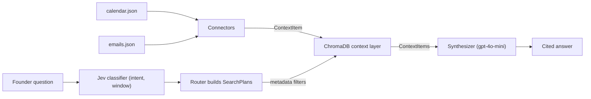

# Founder AI Assistant: Context Engine

A terminal assistant that answers a startup founder's questions from their calendar and email. It does not call tools live to answer. It ingests both sources, normalizes them into one schema, stores them in a local ChromaDB context layer, and retrieves filtered context before an LLM writes a cited answer.

## Data sources

| Source | File | Normalized to |
| --- | --- | --- |
| Google Calendar (mock payloads) | `data/calendar.json` (5 meetings) | `ContextItem` with `source="calendar"` |
| Gmail (mock payloads) | `data/emails.json` (6 emails in 4 threads) | `ContextItem` with `source="email"` |

The connectors read JSON shaped like the real API payloads. A real Google API client, Composio, or Nango can replace a connector without changing storage, routing, or synthesis.

## Setup

Requires Python 3.12+ and [uv](https://docs.astral.sh/uv/).

```bash
uv venv .venv
uv pip install --python .venv -r requirements.txt
cp .env.example .env
```

Set `OPENROUTER_API_KEY` in `.env`. The key must be allowed to call `typesafe/jev-1.13` (question classification) and `openai/gpt-4o-mini` (answers).

The first run downloads ChromaDB's default local embedding model (`all-MiniLM-L6-v2`). Ingestion and embeddings need no API key.

## Run

```bash
uv run --python .venv python main.py          # interactive assistant
uv run --python .venv python main.py --test   # the three evaluation questions
```

Each startup ingests both sources into `./chroma_db`. Type `exit` or `quit`, or press Ctrl+C, to leave the interactive assistant.

`--test` prints each question, the retrieved Context Item ids, and the answer. It exits 0 only when all three questions return an answer.

Relative time ("today", "this week") is resolved against a fixed reference time so results are reproducible: `2026-09-23T09:00:00Z` by default. Set `FOUNDER_REFERENCE_TIME` in `.env` to move it.

## Example questions

| Question | What the engine retrieves |
| --- | --- |
| What should I focus on today? | Today's meetings, plus today's emails that need action: `email_205`, `email_203`, `cal_001`, `cal_002`, `cal_003` |
| What follow-ups am I missing? | Threads whose latest message still needs action: `email_204`, `email_205`, `email_203` |
| What customer issues are showing up repeatedly? | Similarity search over email for customer-problem wording. Finds the EU checkout retry failure in `email_201`, `email_202`, `email_203` |
| What's my next meeting? | The first meeting after the reference time: `cal_001` |

Other questions, such as "Summarize investor activity this week", go through a general similarity search, with a time filter when the question names a window.

## How it works



- **Connectors** (`src/connectors/`) map each raw record to a frozen `ContextItem`. A malformed record raises `NormalizationError`; nothing is partially ingested.
- **Storage** (`src/storage/`) upserts items into a persistent Chroma collection with cosine distance. It stores flat metadata (source, epoch timestamp, sender, thread id, requires-action flag, category) for pre-filtering.
- **Router** (`src/engine/router.py`, `classifier.py`) asks a typed classifier two multiple-choice questions: intent and time window. Python then builds every search plan and epoch bound. The model never writes filters or dates.
- **Synthesizer** (`src/engine/synthesizer.py`) sends only the retrieved items, delimited as untrusted data, with a Chief of Staff prompt that requires `[Calendar: <title>]` and `[Email from <sender>]` citations. An empty retrieval returns a fixed insufficient-context sentence without calling the model.
- **CLI** (`src/cli/`, `main.py`) only wires these together.

Design decisions are recorded in `docs/adr/`. `ARCHITECTURE.md` is the full contract.

## Tests

```bash
uv run --python .venv python -m pytest tests/            # offline suite
uv run --python .venv python -m pytest tests/ -m live -s # live OpenRouter checks
```

Unit and integration tests run against a real Chroma store in a temporary directory with a deterministic embedding function. The classifier and chat model are replaced only at the network boundary, so the default run needs no key and spends no credits. The two live tests are deselected unless you pass `-m live`; they call OpenRouter with `OPENROUTER_API_KEY` and print the retrieved ids and answers for the evaluation questions.

## Tradeoffs

- **Mock connectors instead of OAuth.** This keeps the prototype runnable in minutes and the evaluation reproducible. The connector interface is the seam for real integrations.
- **Classifier plus deterministic plans instead of LLM-written queries.** Intent and window are chosen from fixed labels, so filters and dates cannot be hallucinated. A question outside the five intents falls back to general similarity search.
- **Fixed reference time.** Answers about "today" are reproducible against the mock data instead of drifting with the wall clock.
- **Upsert-only ingestion.** Re-running never duplicates records, but a record removed from `data/` stays in `./chroma_db` until that directory is deleted.
- **Top-5 similarity search.** The repeated-issue query finds all three checkout emails, but also pulls in unrelated emails to fill five slots. The model has to ignore them. A general question such as "list all my meetings" uses that same cap and no calendar filter, so it can omit meetings that another plan returns. "When's my next meeting?" is a separate time-ordered calendar plan and correctly returns Engineering standup (`cal_001`). "List all my meetings" keeps the five nearest items, and the standup is sixth, so the answer never sees it. The synthesizer is told not to call that sample a complete calendar, but it can only describe items retrieval already returned.
- **Prompted citations.** The prompt requires a short briefing, exact titles and sender strings, and no pasted email headers or quoted bodies. The model text is still returned unchanged, so a bad answer is not rewritten. The model sometimes shortens a sender (for example "Sam Ortiz" instead of "Sam Ortiz (Harbor Capital)") or omits citations.

## Future improvements

- **Complete lists without a similarity cap.** Add a classifier choice for "list every meeting" and "list every email." Python would then build a time-ordered fetch of that source with no five-item limit, which is the same style of plan as "next meeting," so the standup and the Acme review would both appear. The answer would be allowed to call that result the full calendar. This needs an architecture decision before the router grows a new label.
- **Show the retrieval next to the answer.** With more time, the interface is the next product improvement, not another prompt tweak. A chat UI can show each answer beside the meetings and emails that produced it, mark a result as "closest five" or "complete list," and make a missing standup visible instead of looking like the assistant forgot it. The same view can show citations as source cards, support meeting prep, and keep the terminal REPL as the evaluation path.
- Real Gmail and Calendar ingestion through OAuth or Composio/Nango, with incremental sync and deletion handling.
- More sources, such as Linear, Slack, and Notion, behind the same connector interface.
- Post-generation citation checks that reject or repair answers citing items that were not retrieved.
- A similarity threshold or reranker so weak matches are dropped instead of filling the top five.
- Meeting prep, which pulls emails from a meeting's attendees before that meeting.
- Local time zones for the founder instead of UTC day windows.
